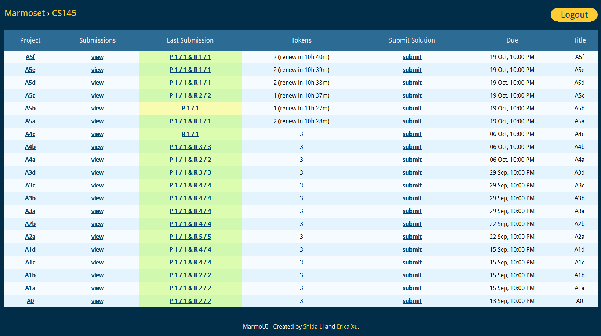

# marmoui-edit
Small edits I made to the marmoui-edit Userscript 

# Changes

* Some background colors were being overriden by default settings, fixed it by spamming !important
* Reload FAST!!!!!!!!!!!!!!1111LIYHGKJSDHGFUAIWEYRFHGWOEIUYFG 
* Changed the aesthetics (can revert to old theme in the old version)

# Picture

